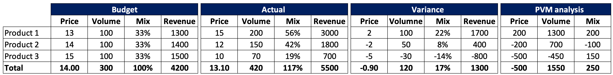
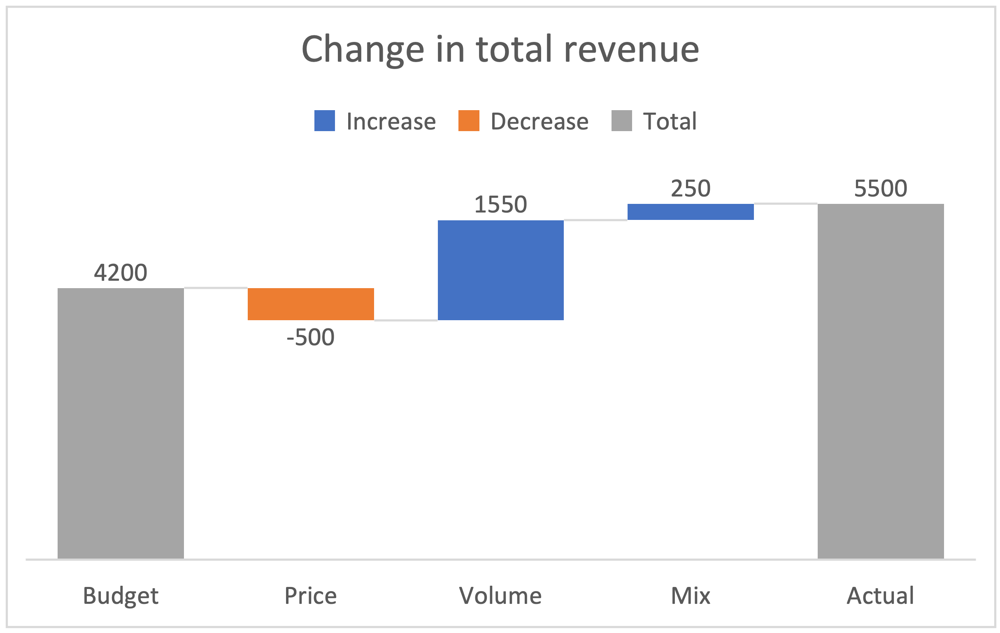

## What is PVM?  

PVM is an approach to explain variance in revenue or margins caused by three main components: price, volume, and mix.  

- Price impact: variation due to higher or lower price changes.  
- Volume impact: variation due to total sales units.  
- Mix impact: measures the impact resulting from a change in the proportion of a specific item to the total portfolio.  

The method is used in variance analysis (actual vs. budget, this year vs. last year) to help understand the factors contributing to variances. Input required comprises price, quantity/volume by products/categories. The spreadsheet and chart below give a simple way to explain it.

## Why I learn it

When I was at MSD, my boss told me to prepare an analysis for the forecasted sales. She wanted a PVM analysis. Yet I was new to FP&A and had no idea what it was. There are so many FP&A things I need to learn, and PVM is just an example of that knowledge. And yet here is my note for what I need to remember about PVM.
